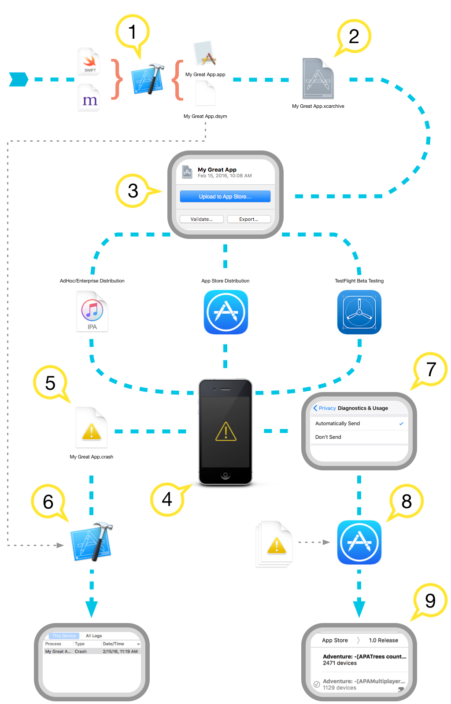
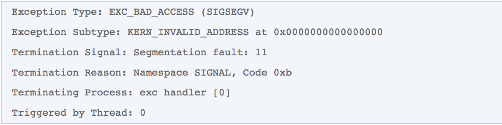

# Technical Note TN2151 崩溃报告分析

当app崩溃时，将会产生一份用于分析崩溃原因的崩溃报告。这篇文档包含关于如何符号化和分析崩溃报告。

## 介绍

​        当一个app崩溃时，设备会创建并且存储一份崩溃报告。崩溃报告描述了app结束时的状态，大部分包含了每个线程完整的回溯和很有用的调试信息。你需要浏览报告来了解是什么使你的app崩溃了，并且尝试去修复它。

​	带有回溯的崩溃报告在分析前需要进行符号化处理。符号化把内存地址替换为人可读的方法名和行号信息。如果你通过Xcode的设备窗口获取到设备的崩溃日志，它们将在很短时间内自动为你进行符号化处理。否则的话，你需要自己把.crash文件导入Xcode设备窗口来进行符号化处理.

​	低内存报告不同于其他的崩溃报告，在低内存报告中是没有回溯的。当发生低内存崩溃时，你应该去调查app的内存使用模式和你对于接收到低内存警告的回应。这篇文档将会为你指出几个有用的内存管理参考

## 获取崩溃报告和低内存报告

[Debugging Deployed iOS Apps](https://developer.apple.com/library/ios/#qa/qa1747/_index.html) 说明了如何直接从iOS设备中获取报告

[Analyzing Crash Reports](https://developer.apple.com/library/ios/documentation/IDEs/Conceptual/AppDistributionGuide/AnalyzingCrashReports/AnalyzingCrashReports.html) 说明了如何获取到从TestFlight bata测试者和App Store下载用户收集的崩溃报告

## 崩溃报告的符号化

符号化指的是将回溯地址转化为源代码方法或函数名的过程。没有经过符号化的崩溃报告很难去找到崩溃发生的位置

注:低内存报告不需要进行符号化处理

注:macOS的崩溃崩溃报告在生成时就会进行部分符号化处理，这部分主要针对iOS、watchOS和tvOS，但是总体过程和macOS是相似的

图1:崩溃报告概览

1.当编译器将源代码转换为机器代码时，它还会生成调试符号，将编译后的二进制文件中的每个机器指令映射到它所产生的源代码行。根据调试信息格式(调试信息格式)构建设置，这些调试符号存储在二进制文件中，或者在一个伴生的调试符号(dSYM)文件中。默认情况下，应用程序的调试版本在编译后的二进制文件中存储调试符号，而应用程序的发布版本则将调试符号存储在一个相应的dSYM文件中，以减少二进制文件的大小。

调试符号文件和应用程序二进制文件通过构建UUID一同绑定在每个构建版本上。应用程序的每次构建将会生成一个新的UUID，新的UUID惟一地标识该构建。即使一个功能相同的可执行文件从相同的源代码中重新构建，使用相同的编译器设置，它也会有不同的构建UUID。来自后续构建的调试符号文件，即使是来自相同的源文件，也不会与来自其他构建版本的二进制文件进行互操作。

2.当您存档应用程序用于发布是，Xcode将收集应用程序二进制文件和.dSYM文件，并将它们存储在您的主文件夹内的一个位置。您可以在Xcode Organizer的Archived部分中找到所有存档的应用程序。有关创建存档的更多信息，请参阅[App Distribution Guide](https://developer.apple.com/library/ios/documentation/IDEs/Conceptual/AppDistributionGuide/Introduction/Introduction.html)

Important:要符号化从测试者、app 审核或者客户获取的崩溃报告，你必须得到之前发布的版本构建归档文件

3.如果你在应用App Store分发你的应用，或者使用Test Flight进行测试，在你把存档文件上传至iTunes Connect时，会获取到一个是否选择包含dSYM文件的选项。在提交对话框中，选择“Include app symbols for your application…”。上传您的dSYM文件对于获取来自TestFlight用户和选择共享诊断数据的客户的崩溃报告是必要的。要了解关于崩溃报告服务的更多信息，请参考[App Distribution Guide](https://developer.apple.com/library/ios/documentation/IDEs/Conceptual/AppDistributionGuide/AnalyzingCrashReports/AnalyzingCrashReports.html)

important:app审核中的崩溃报告是没有符号化的，即使你上传存档文件时选择上传dsYM文件。你需要自己使用Xcode符号化从app审核中获取的崩溃报告

4.当你的app崩溃时，设备将会产生和存储一份未符号化的崩溃报告

5.用户可以通过在 [Debugging Deployed iOS Apps](https://developer.apple.com/library/ios/#qa/qa1747/_index.html)的步骤中直接获取设备中的崩溃报告，如果你的app是通过AdHoc或者企业发布证书分发的，这是你从用户获取崩溃报告的唯一方式

6.从设备中获取的崩溃报告是未符号化的，需要使用Xcode进行符号化处理。Xcode使用dsYM文件关联app二进制文件，将回溯中每个地址替换为源代码中的位置。处理结果是一份符号化的崩溃报告

7.当用户选择共享诊断数据或者用户通过TestFlight安装app的beta版本时，崩溃报告将会上传到App Store

8.App Store对崩溃报告进行符号化处理，然后对相似的崩溃报告进行分组。相似的崩溃报告集合被称为Crash Point

9.符号化的崩溃报告在Xcode的Crash Organizer中变得可用

## Bitcode

Bitcode是编译程序的中间表示。当您存档应用程序时启用了Bitcode，编译器会生成包含Bitcode的二进制代码，而不是机器码。一旦这个二进制文件被上传到App Store，Bitcode被编译为机器码。App Store将来可能会再次编译Bitcode，以利用未来编译器的对代码进行优化，而无需对你进行任何操作。

图2:Bitcode编译过程概览

因为你的二进制文件的最终编译发生在App Store上，所以你的Mac不会获取到对应的dsYM文件，这个文件在符号化app审核或者用户直接发给你的崩溃报告时需要用到。尽管在存档应用程序时生成了dSYM文件，但它只适用于Bitcode二进制文件，不能用于符号化从以上两种方式获取到的崩溃报告。App Store在Bitcode编译时生成对应的dsYM文件，你可以在Xcode或者Itunes Connet网站上进行下载。你需要下载这些dsYM文件，以便于对app审核或者用户直接发送的崩溃报告进行符号化处理。通过崩溃报告服务获取到的崩溃报告将被自动进行符号化处理。

important: App Store编译的二进制文件和你原本提交的二进制文件的UUID是不一样的

##### 从Xcode下载dsYM文件

1.在Archives Organizer,选择你原本提交到App Store的存档文件

2.点击下载dsYM文件按钮

Xcode下载dsYM文件，并将其插入选择的存档中

##### 从iTunes Connect网站下载dsYM文件

1.打开app详情页

2.点击活动

3.从所有版本构建中，选择一个版本

4.点击下载dsYM文件链接

## 区分崩溃报告是否经过符号化

崩溃报告可能是未符号化的，完全符号化的，或部分符号化的。未符号化的崩溃报告中调用栈中没有方法或函数名。相反，在加载的二进制映像中有可执行代码的十六进制地址。在一个完全符号化的崩溃报告中，调用栈中的每一行中的十六进制地址都被相应的符号替换。在部分符号化的崩溃报告中，只有回溯中的一部分地址被替换为相应的符号。

显然，您应该尝试全面地符号化您收到的任何崩溃报告，因为它将提供关于崩溃的最深刻的见解。部分符号化的的崩溃报告可能包含了足够的信息来了解崩溃，这取决于崩溃的类型，以及调用栈中哪些部分成功地符号化了。一个未符号化的崩溃报告几乎是没有用的。

图3:不同符号化等级的相同调用栈

## 使用Xcode符号化崩溃报告

Xcode会自动尝试去符号化获取到的所有崩溃报告。你需要为符号化做的事就是把崩溃报告添加到Xcode Organizer

注：Xcode不会接收非.carsh扩展名的崩溃报告。如果你接收到一个没有扩展名或者.txt扩展的崩溃报告文件，在进行以下步骤前，你需要用.crash扩展给它重命名。

1.连接iOS设备和Mac

2.选择“Window”菜单中的“Devices”

3.在“DEVICES”部分下，选择一个设备

4.点击右侧“Device Information”部分的“View Device Logs”按钮

5.将崩溃报告拖入左侧推出的控制面板

6.Xcode会自动对崩溃报告进行符号化处理，并显示结果

为了符号化一份崩溃报告，Xcode需要进行以下配置：

- 崩溃app的二进制文件和dsYM文件
- 应用程序链接的所有定制框架的二进制文件和dSYM文件。对于与应用程序一起构建的框架，它们的dSYM文件与应用程序的dSYM文件一道被复制到归档文件中。对于由第三方构建的框架，您需要向作者询问dSYM文件。
- 应用程序在崩溃时运行的操作系统的符号。这些符号包含框架在特定OS版本下的调试信息(e.g,iOS 9.3.3)。操作系统的符号是特定于架构的——针对64位设备的iOS版本将不会包含armv7符号。Xcode将自动从你连接到Mac的每一个设备上复制OS符号。

如果这些都没有进行配置，Xcode将不会进行符号化处理，或者只进行部分符号化处理

## 使用atos符号化处理

 [atos](x-man-page://atos)命令将数字地址转为它们对应的符号。如果能获取到完整的调试符号信息，atos的输出将会包含文件名和资源行数信息。atos命令可以用于符号化调用栈中特别的地址，无论这个崩溃报告是为符号化还是部分符号化的。以下为atos使用：

1. 找到你想要符号化的某一行，记录第二列的二进制映像名和第三列的地址
2. 在崩溃报告底部的二进制映像表查找该二进制映像名，记录架构信息和映像的地址信息

图4:使用atos需要用到的信息

1. 为二进制文件定位dSYM文件。您可以使用Spotlight来查找匹配的dSYM文件，以二进制映像的UUID作为检索的key。具体参阅[Symbolication Troubleshooting](https://developer.apple.com/library/content/technotes/tn2151/_index.html#//apple_ref/doc/uid/DTS40008184-CH1-SYMBOLICATIONTROUBLESHOOTING)。dSYM文件是一个包，其中包含一个附带DWARF调试信息的文件，这些调试信息在构建时编译器生成。在调用atos时，您必须提供该文件的路径，而不是dSYM包。
2. 通过以上，你可以使用atos命令符号化调用栈中的地址。你可以指定多个地址，用空格分开                            `atos -arch <Binary Architecture> -o <Path to dSYM file>/Contents/Resources/DWARF/<binary image name> -l <load address> <address to symbolicate>`

表1:atos通过以上步骤使用样例和输出结果

| `$ atos -arch arm64 -o TheElements.app.dSYM/Contents/Resources/DWARF/TheElements -l 0x1000e4000 0x00000001000effdc` |
| ---------------------------------------- |
| `-[AtomicElementViewController myTransitionDidStop:finished:context:]` |

## 符号化故障修复

如果Xcode没有完全符号化崩溃报告，可能是因为缺少app二进制文件的dsYM文件、app链接的框架的dsYM文件或者app崩溃对应的操作系统的设备符号。

图5:定位二进制映像的UUID

1.找到Xcode调用栈中符号化失败的一行。记录第二行的二进制映像名

2.在崩溃报告底部的二进制映像表查找该二进制映像名。这个列表包含在崩溃时被加载的二进制映像对应的UUID

表2:你可以使用grep命令快速定位二进制映像表的入口

3.将UUID转为以8-4-4-4-12分割的字符串(XXXXXXXX-XXXX-XXXX-XXXX-XXXXXXXXXXXX).记录的所有字母必须为大写

4.使用mdfind命令的"com_apple_xcode_dsym_uuids == <UUID>"请求搜索UUID

表3:使用mdfind命令查找对应UUID的dsYM文件

5.如果Spotlight找到对应UUID的sdYM文件，将会打印相应的路径。如果没有找到对应的sdYM文件，mdfind将会退出，不打印任何东西

如果Spotlight为二进制文件找到了一个dSYM文件，但是Xcode无法在那个二进制映像中符号化地址，那么您应该提交一个bug。将崩溃报告和相关的dSYM文件附加到bug报告。作为一种变通方法，您可以使用atos手动地进行地址的使用。见 [Symbolicating Crash Reports With atos](https://developer.apple.com/library/content/technotes/tn2151/_index.html#//apple_ref/doc/uid/DTS40008184-CH1-SYMBOLICATE_WITH_ATOS)

如果Spotlight没有找到二进制映像的dSYM，请验证您仍然有对应app版本的Xcode存档，该存档文件是否位于Spotlight可以找到的地方(您的主目录中的任何位置都应该这样做)。如果您的应用程序是启用了Bitcode，请确保您已经从App Store下载了最终编译对应的dSYM文件。

如果你认为有正确的二进制影响对应sdYM，你可以使用dwarfdump命令打印匹配的UUID，你也可以使用这个命令打印二进制文件的UUID

xcrun dwarfdump --uuid <Path to dSYM file>

注：你必须有原本提交到App Store上崩溃app的存档。dsYM和app二进制文件一同绑定在每个构建版本上。创建一份新的存档，即使有相同的源代码和构建设置，也不能产生和崩溃报告相互关联的sdYM文件了。

如果你不在拥有这个存档，你需要提交新版本的app来获取存档。以后你可以为新版本符号化崩溃报告

## 崩溃报告分析

这个部分讲述标准崩溃报告的各个部分

#### 头部

表4:崩溃报告头部摘录

大部分的领域都是不言自明的，但也有一些值得特别注意:

- Incident Identifier:报告的独特标识，没有有相同Incident Identifier的两份报告
- CrashReporter Key:一个匿名设备标识符。来自同一设备的两个报告将包含相同的值。
- Beta Identifier:崩溃应用程序的设备和app供应商的组合的唯一标识符。来自同一app供应商和同一设备的应用程序的两个报告将包含相同的值。这个字段只在通过TestFlight分发的应用程序生成的崩溃报告中出现，并替换CrashReporter Key。
- Process:崩溃过程的可执行名称,这个匹配app info.plist文件中的CFBundleExecutable键对应的值
- Version:崩溃版本号，由app的CFBundleVersion和CFBundleVersionString拼接而成
- Code Type:崩溃进程的目标架构，通常是`ARM-64`, `ARM`, `x86-64`, 或者 `x86`
- Role:崩溃时分配给进程的任务角色
- OS Version:崩溃发生的系统版本，包含构建号

#### 异常信息

不要与objective-c/c++异常混淆(尽管这个可能是崩溃的原因)，这个部分列出了Mach异常类型和相关的字段，这些字段提供了关于崩溃性质信息。并不是所有的字段都会出现在每个崩溃报告中。

表5:因未捕获的Objective-C异常导致进程终止生成的崩溃报告的异常部分

表6:因废弃空指针导致进程终止生成的崩溃报告的异常部分

本节中可能出现的字段的解释:

- Exception Codes:编码到一个或多个64位十六进制数字的处理器关于异常特定信息。通常情况下，这个字段不会出现，因为崩溃报告者解析异常代码，把它们转化为人类可读的描述在其他字段中显示。
- Exception Subtype: Exception Codes的人类可读名
- Exception Message:从异常代码中提取的额外的人类可读信息
- Exception Note:附加的信息不是特定于一个异常类型。如果这个字段包含SIMULATED (this is NOT a crash)，然后这个过程没有崩溃，但是在系统的请求下被杀死，典型的像看门狗。
- Termination Reason:进程终止的退出原因。系统的关键组件，无论进程内的还是进程外的，当遇到一个fatal error(eg,错误的代码签名、依赖库丢失、没有适当权限下访问私有敏感信息)